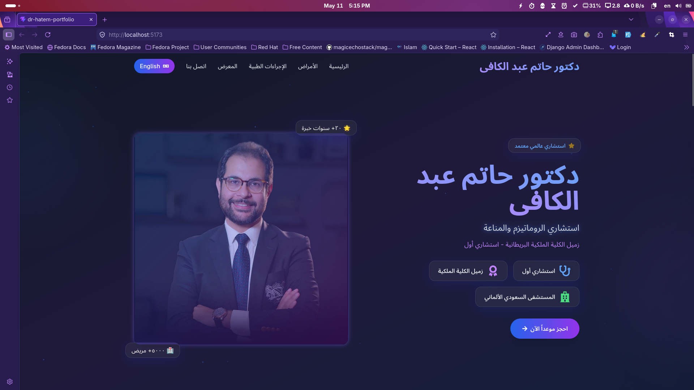
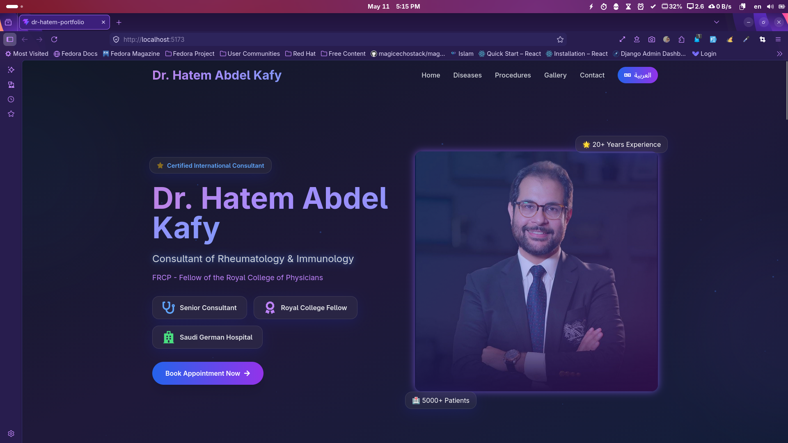

# Dr. Hatem Abdel Kafy Portfolio

A modern, responsive portfolio website for **Dr. Hatem Abdel Kafy** – Consultant of Rheumatology & Immunology.  
Built with **React + Vite** and styled using **Tailwind CSS** with smooth animations and bilingual support.

---

## 🌍 Live Demo

**Live URL:**  
[https://dr-hatem-portfolio.vercel.app/](https://dr-hatem-portfolio.vercel.app/)

---

## 🧱 Tech Stack

| Technology | Purpose |
|------------|---------|
| **React 18** | Frontend framework |
| **Vite** | Build tool & dev server |
| **Tailwind CSS** | Styling & animations |
| **Framer Motion** | Smooth animations |
| **i18next** | Arabic/English translation |
| **React Icons** | Icon library |

---

## ✨ Project Features

- ✅ Fully responsive design (mobile, tablet, desktop)
- ✅ Bilingual support (Arabic / English)
- ✅ Dark theme with glassmorphism effects
- ✅ Animated background with floating particles
- ✅ Interactive disease cards with flip effect
- ✅ WhatsApp appointment booking system
- ✅ Photo gallery with lightbox viewer
- ✅ Social media integration
- ✅ Google Maps integration for hospital location
- ✅ One-click phone number copy

---

## 🖼️ Screenshots

### Arabic Version - Home Page


### English Version - Home Page


> **Note:** Replace the images above with your actual screenshots in the `screenshots` folder.

---

## 🎥 Video Demo
<video src="./path-to-video-demo.mp4" controls width="100%">
  Your browser does not support the video tag.
</video>


---

## 🚀 Getting Started (Local Development)

> ### Prerequisites
>- Node.js (v18 or higher)
>- npm or yarn

### Installation

```bash
# Clone the repository
git clone https://github.com/IslamHamdyy/dr-hatem-portfolio.git

# Navigate to project
cd dr-hatem-portfolio

# Install dependencies
npm install

# Start development server
npm run dev